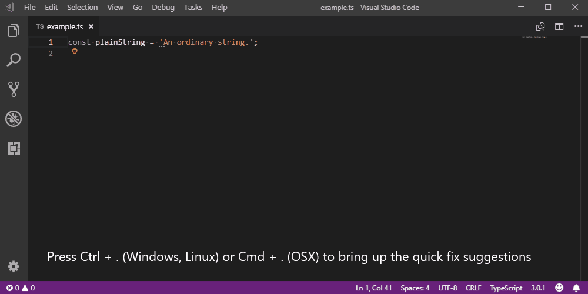
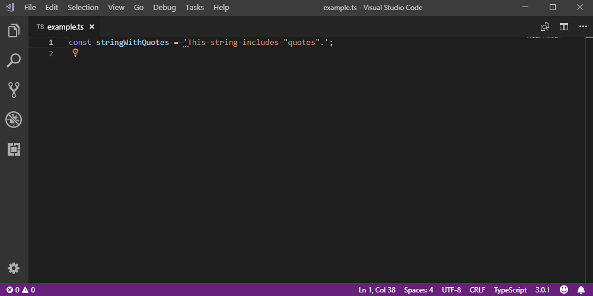
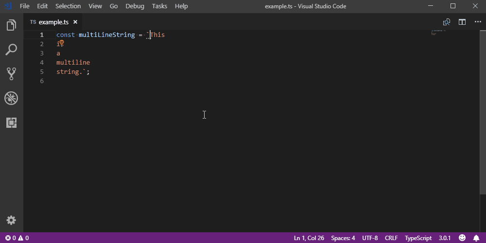
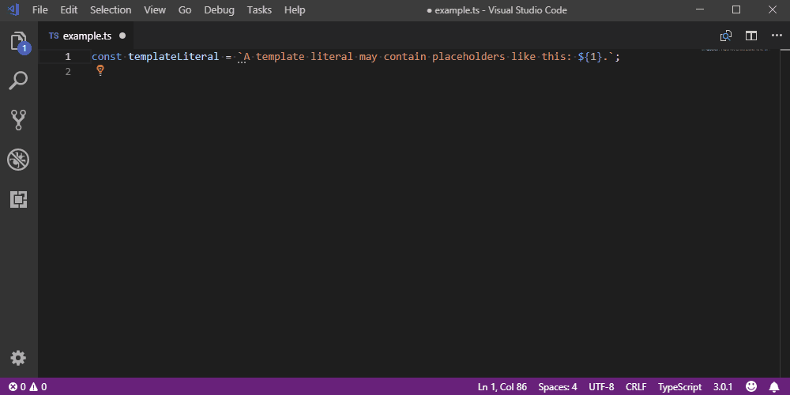
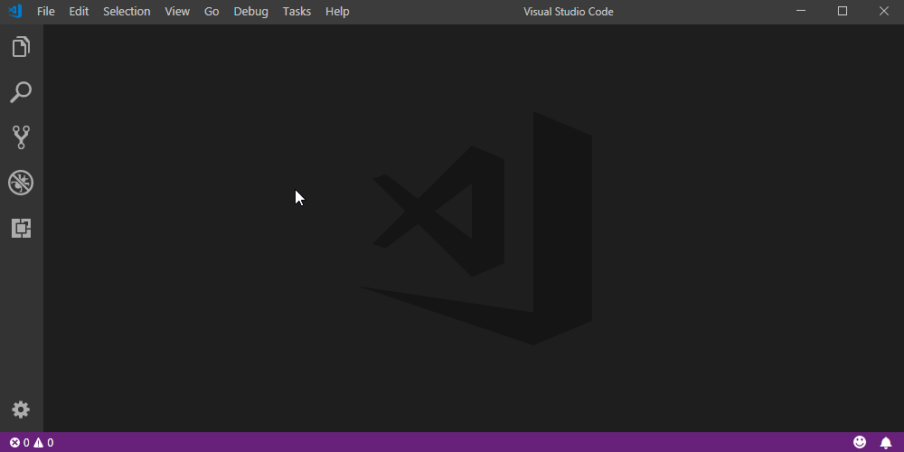

# BacktiX (vscode-backtix) README

Have you ever started typing an ordinary plain string in **JavaScript** or **TypeScript**, only to realize that it actually would be much fancier to use one of those template literals instead?

Have you ever pasted in some code from Stack Overflow that uses double quotes, but your project uses single quotes?

How many steps did you have to take in these cases, only to convert the strings to the desired format?

If your answer to the last question is *"Too many"* – **BacktiX** to the rescue! No more fumbling around, just use the **quick fixes** this extension provides and convert strings instantly.

## Features

* Convert any string type to any other string type, for example:
  * Template literals to single quoted strings.
  * Single quoted strings to double quoted strings.
  * Double quoted strings to template literals.

  
* If the target quote character is present in the string, it will be escaped upon conversion, already escaped quote characters will be "unescaped" upon conversion to another quote type.
  
* Multi-line template literals will be moved to a single line upon conversion, the newline characters will be inlined.
  
* Expressions in template placeholders will be concatenated with `+` symbols.
  
* Easily add placeholders (`${}`) in template literals.
  

Adding a placeholder as well as the conversions are offered as quick fixes, three dots below the beginning of a string indicate that there is a quick fix available. Access these by either pressing `Ctrl`-`.` (Windows, Linux) or `Cmd`-`.` (OSX). Alternatively you can click on the light bulb icon to bring them up.

## Installation



1. Launch VS Code.
1. Press `Ctrl`-`Shift`-`X` (Windows, Linux) or `Shift`-`Cmd`-`X` (OSX) to bring up the extensions explorer.
1. Search for this extension in Marketplace.
1. Install it.
1. Reload Visual Studio Code.

## Requirements

VS Code obviously, apart from that: none.

## Extension Settings

> Please restart VS Code for any changes to these extension settings to take effect.

This extension contributes the following settings:

* `backtix.languages`: Select the languages the conversions should be enabled for. Defaults:
  ```json
  "backtix.languages": {
    "javascript": true,
    "typescript": true,
    "javascriptreact": false,
    "typescriptreact": false
  }
  ```
* `backtix.conversions`: Specify the target quote types you want conversions to be offered for. Defaults:
  ```json
  "backtix.conversions": {
    "convertToSingleQuotes": true,
    "convertToDoubleQuotes": true,
    "convertToBackticks": true
  }
  ```
* `backtix.conversionTexts`: Specify the tooltip and quick fix texts for the offered conversions. Defaults:
  ```json
  "backtix.conversionTexts": {
    "convertToSingleQuotes": "Convert to single quotes.",
    "convertToDoubleQuotes": "Convert to double quotes.",
    "convertToBackticks": "Convert to backticks."
  }
  ```
* `backtix.placeholders`: Options for 'Add placeholder.'. Defaults:
  ```json
  "backtix.placeholders": {
    "active": true,
    "text": "Add placeholder."
  }
  ```

## Known Issues

### Parentheses (or lack thereof)

#### Example 1:

```typescript
console.log(`The sum of 1 and 2 is ${1 + 2}.`);
// The sum of 1 and 2 is 3.
```

If you convert the backticks to single quotes you will get the following result:

```typescript
console.log('The sum of 1 and 2 is ' + 1 + 2 + '.');
// The sum of 1 and 2 is 12.
```

Correctly it would have to be:

```typescript
console.log('The sum of 1 and 2 is ' + (1 + 2) + '.');
// The sum of 1 and 2 is 3.
```


#### Example 2:

```typescript
const myOpinion = `Template literals are the ${1 < 3 ? 'greatest' : 'worst'} thing since sliced bread.`;
```

If you convert the backticks to single quotes, the result will look like this:

```typescript
const myOpinion = 'Template literals are the ' + 1 < 3 ? 'greatest' : 'worst' + ' thing since sliced bread.';
```

This will give you an error saying `Operator '<' cannot be applied to types 'string' and 'number'.`  To correct this, parentheses would have to be applied in one of the following ways:

```typescript
const myOpinion = 'Template literals are the ' + (1 < 3) ? 'greatest' : 'worst' + ' thing since sliced bread.';
```

```typescript
const myOpinion = 'Template literals are the ' + (1 < 3 ? 'greatest' : 'worst') + ' thing since sliced bread.';
```

#### Why are parentheses not just always added then?

The reason this does not happen at the moment is that it does not make sense or rather does not look good to add them in all situations. Consider the following example:

```typescript
console.log(`The result is ${x}.`);
```

The conversion to single quotes would produce superfluous parentheses in this case.

```typescript
console.log('The result is ' + (x) + '.');
```

In order to avoid that I would have to find some clever way to determine when to add parentheses and when not to. And since it is way harder to delete parentheses in VS Code than it is to add them (just select the text you want the parentheses to be around and press the desired opening parentheses key), this is not the first priority.

### Other

None at the moment.

Please open an issue on GitHub should you come across a string conversion that does not lead to the desired result so I can have a look into what is going wrong. Thanks!

## Release Notes

See the change log (`CHANGELOG.md`) for detailed release information.
